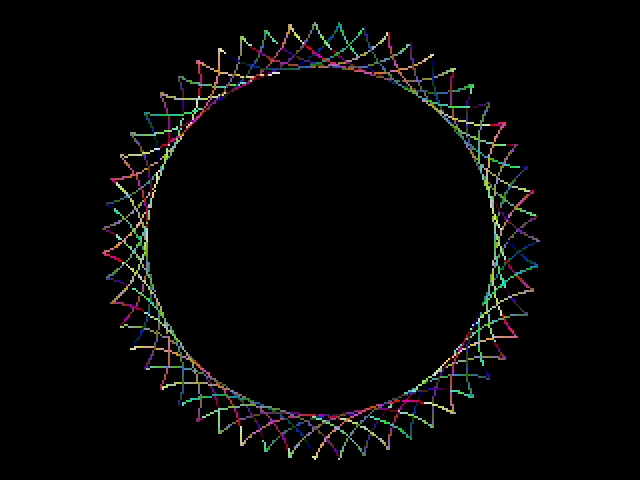
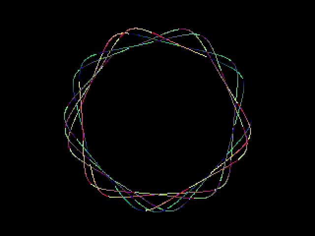

<!-- SPDX-License-Identifier: MIT -->
<!-- SPDX-FileCopyrightText: Copyright 2025 Sam Blenny -->
# Fruit Jam Spirals

This draws hypotrochoid spirals (like Spirograph) for Fruit Jam's DVI display.

Hypotrochoids are a type curve like the ones you can draw with a Spirograph.
For more details on the math, check out the
[Wikipedia](https://en.wikipedia.org/wiki/Hypotrochoid) or
[Wolfram MathWorld](https://mathworld.wolfram.com/Hypotrochoid.html)
Hypotrochoid pages.

This code was developed and tested on a pre-release revision B Fruit Jam
prototype board using CircuitPython 10.0.0-alpha.6 from the circuitpython.org
[Fruit Jam downloads](https://circuitpython.org/board/adafruit_fruit_jam/) page.
Things may change by the time CircuitPython 10.0.0 is released.

