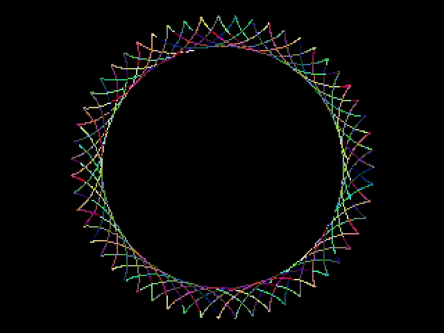
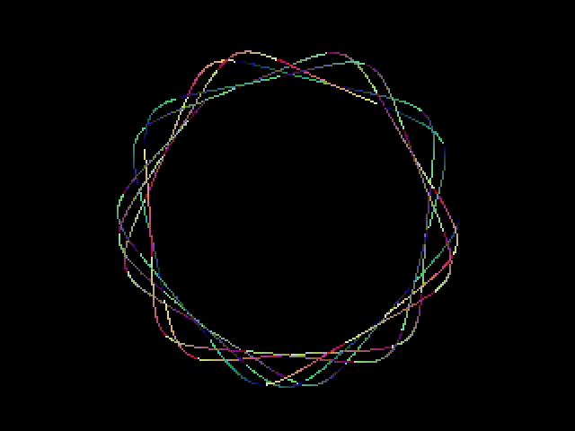
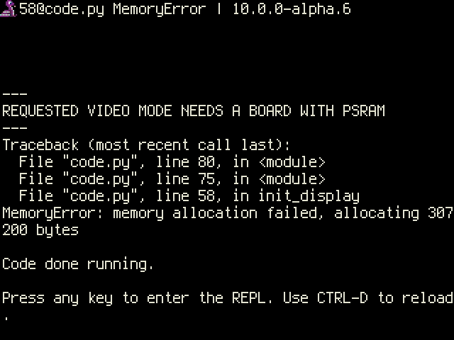

<!-- SPDX-License-Identifier: MIT -->
<!-- SPDX-FileCopyrightText: Copyright 2025 Sam Blenny -->
# Fruit Jam Spirals

This draws hypotrochoid spirals (like Spirograph) for Fruit Jam's DVI display.

Hypotrochoids are a type curve like the ones you can draw with a Spirograph.
For more details on the math, check out the
[Wikipedia](https://en.wikipedia.org/wiki/Hypotrochoid) or
[Wolfram MathWorld](https://mathworld.wolfram.com/Hypotrochoid.html)
Hypotrochoid pages.

This code was developed and tested on a pre-release revision B Fruit Jam
prototype board using CircuitPython 10.0.0-alpha.6 from the circuitpython.org
[Fruit Jam downloads](https://circuitpython.org/board/adafruit_fruit_jam/) page.
Things may change by the time CircuitPython 10.0.0 is released.

## Video Mode Board Compatibility

Based on my testing, it seems like you need a board with a PSRAM chip in order
to use 640x480 with 8-bit color depth. This is what I found when I tested the
spiral drawing code on my Fruit Jam and my Metro RP2350 with No PSRAM:

| Video Mode     | Fruit Jam | Metro RP2350 No PSRAM     |
| -------------- | --------- | ------------------------- |
| 320x240, 8-bit | Yes!      | Yes!                      |
| 640x480, 8-bit | Yes!      | MemoryAllocation error :( |

When I tried 640x480 8-bit on Metro RP2350 with No PSRAM, I got a
MemoryAllocation exception, like this:

